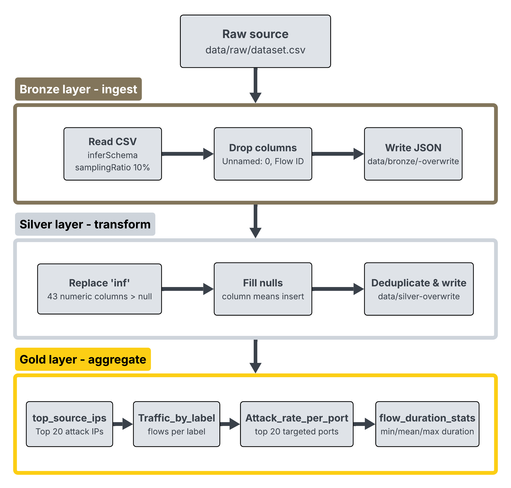

# DDoS Pipeline

A distributed data processing pipeline built on Apache Spark that detects DDoS attack patterns in network traffic data.

The pipeline follows a **medallion architecture** (Bronze → Silver → Gold) and is fully orchestrated by **Prefect** with an automated schedule.

---

## Architecture



```
Source CSV  →  Bronze (JSON)  →  Silver (cleaning)  →  Gold (aggregations)
                                                              ↑
                                                        Prefect flow
                                                     (schedule: cron 2:00)
```

---

## Project Structure

```
BGD_03/
├── schedule/
│   └── ddos_dag.py           # Prefect flow - main orchestrator entry point
├── pipeline/
│   ├── main.py               # Direct run without orchestrator
│   ├── ingest.py             # Bronze: CSV → JSON
│   ├── transform.py          # Silver: cleaning and deduplication
│   ├── aggregate.py          # Gold: analytical aggregations
│   └── settings.py           # All configuration in one place
├── sources/
│   ├── source_config.yml     # Data source parameters
│   └── schema.md             # Schema description and layer overview
├── tech/
│   └── docker-compose.yml    # Spark cluster + Prefect server + pipeline runner
├── data/
│   ├── raw/
│   │   └── dataset.csv       # Input file (not committed to Git)
│   ├── bronze/               # Raw data in JSON format
│   ├── silver/               # Cleaned data in JSON format
│   └── gold/                 # Output tables
│       ├── top_source_ips/
│       ├── traffic_by_label/
│       ├── attack_rate_by_port/
│       └── flow_duration_stats/
├── architecture.png
├── requirements.txt
└── README.md
```

---

## Requirements

- Docker + Docker Compose
- Dataset CSV placed at `data/raw/dataset.csv`
- Download dataset from: https://www.kaggle.com/datasets/devendra416/ddos-datasets

---

## How to Run

### Via Prefect orchestrator

```bash
docker compose -f tech/docker-compose.yml up
```

This starts:
1. **Prefect server** - UI available at `http://localhost:4200`
2. **Spark master** - UI available at `http://localhost:8080`
3. **Spark worker** - waits for a healthy master
4. **Pipeline runner** - executes `schedule/ddos_dag.py`, waits for both above

Prefect automatically runs the pipeline every day at 2:00 AM (CronSchedule).
Run history, logs and task statuses are visible in the Prefect UI.

### Directly without orchestrator

```bash
cd pipeline
python main.py
```

The pipeline is **idempotent** - safe to re-run at any time, previous outputs are overwritten.

---

## Processing Layers

| Layer | File | Description |
|-------|------|-------------|
| Bronze | `ingest.py` | Read CSV, drop unused columns (`Unnamed: 0`, `Flow ID`), write to JSON |
| Silver | `transform.py` | Replace `±Infinity` with `null`, impute column means, deduplicate |
| Gold | `aggregate.py` | 4 analytical tables (see below) |

### Gold Layer Output Tables

| Table | Description |
|-------|-------------|
| `top_source_ips` | Top 20 source IPs by attack flow count |
| `traffic_by_label` | Flow count and packet totals per label (ddos / Benign) |
| `attack_rate_by_port` | Top 20 destination ports by attack-flow rate |
| `flow_duration_stats` | Mean, min and max flow duration per label |

---

## Configuration

All settings are in `pipeline/settings.py`. Data source parameters are described in `sources/source_config.yml`.

| Setting | Default | Description |
|---------|---------|-------------|
| `input_file` | `data/raw/dataset.csv` | Path to source CSV |
| `label_attack` | `ddos` | Attack label value in the dataset |
| `label_benign` | `Benign` | Benign label value in the dataset |
| `spark_shuffle_partitions` | `8` | Tune based on dataset size and available cores |
| `spark_app_name` | `ddos_pipeline` | Spark application name (visible in Spark UI) |

---

## Orchestration (Prefect)

`schedule/ddos_dag.py` defines a Prefect flow consisting of three sequential tasks:

```
ddos_pipeline_flow
├── task_ingest      (Bronze, retries=2)
├── task_transform   (Silver, retries=2)
└── task_aggregate   (Gold,   retries=2)
```

Each task is configured with 2 retries and a 30-second retry delay.
The flow is registered with a `CronSchedule(cron="0 2 * * *")`.