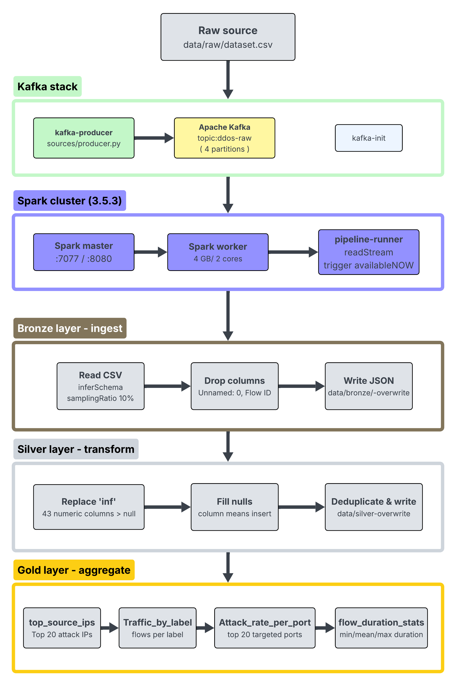

# DDoS Pipeline

A distributed data processing pipeline built on Apache Spark that detects DDoS attack patterns in network traffic data.

The pipeline follows a **medallion architecture** (Bronze > Silver > Gold), uses **Apache Kafka** as a streaming queue, and is fully orchestrated by **Prefect**.

---

## Architecture



---

## Project Structure

```
BGD_03/
├── data/
│   ├── raw/
│   │   └── dataset.csv           # Input file (not committed to Git)
│   ├── checkpoints/
│   │   └── bronze/               # Spark Structured Streaming checkpoint (Kafka offsets)
│   ├── bronze/                   # Raw data in JSON format
│   ├── silver/                   # Cleaned data in JSON format
│   └── gold/
│       ├── top_source_ips/
│       ├── traffic_by_label/
│       ├── attack_rate_by_port/
│       └── flow_duration_stats/
├── pipeline/
│   ├── main.py                   # Direct run without orchestrator
│   ├── ingest.py                 # Bronze: Kafka stream → JSON
│   ├── transform.py              # Silver: cleaning and deduplication
│   ├── aggregate.py              # Gold: analytical aggregations
│   └── settings.py               # All configuration in one place
├── schedule/
│   └── ddos_dag.py               # Prefect flow - main orchestrator entry point
├── sources/
│   ├── producer.py               # Reads CSV, publishes rows to Kafka topic
│   ├── source_config.yml         # Data source parameters
│   └── schema.md                 # Schema description and layer overview
├── tech/
│   └── docker-compose.yml        # Full stack: Kafka + Spark + Prefect + pipeline runner
├── architecture.png
├── README.md
└── requirements.txt
```

---

## Requirements

- Docker + Docker Compose
- Dataset CSV placed at `data/raw/dataset.csv`
- Download from: https://www.kaggle.com/datasets/devendra416/ddos-datasets

---

## How to Run

### 1. Place the dataset

```bash
mkdir -p data/raw
# copy dataset.csv into data/raw/
```

### 2. Start the full stack

```bash
docker compose -f tech/docker-compose.yml up
```

This starts (in dependency order):

| Container | Role | URL                     |
|---|---|-------------------------|
| `zookeeper` | Kafka cluster coordination | none                    |
| `kafka` | Message broker | `localhost:9092`        |
| `kafka-init` | Creates topic `ddos-raw`, then exits | none                    |
| `kafka-producer` | Reads CSV, publishes rows to Kafka | none                    |
| `prefect-server` | Orchestration UI and scheduler | `http://localhost:4200` |
| `spark-master` | Spark cluster manager | `http://localhost:8080` |
| `spark-worker` | Spark executor (4 GB / 2 cores) | `http://localhost:8081` |
| `pipeline-runner` | Runs `ddos_dag.py`, processes Kafka stream | none                    |

### 3. Monitor

- **Prefect UI** - `http://localhost:4200` - flow runs, task status, logs
- **Spark UI** - `http://localhost:8080` - active jobs, stages, executors

### 4. Run directly without orchestrator

```bash
cd pipeline
python main.py
```

### 5. Stop

```bash
docker compose -f tech/docker-compose.yml down
```

To also remove persistent volumes:

```bash
docker compose -f tech/docker-compose.yml down -v
```

---

## Streaming Design

Data flows through Kafka before reaching Spark:

1. `kafka-producer` reads `dataset.csv` row by row and publishes each record as a JSON message to topic `ddos-raw`.
2. `ingest.py` uses `spark.readStream.format("kafka")` with `trigger(availableNow=True)` - processes all available messages and exits cleanly (idempotent batch-style run from a streaming source).
3. Kafka offsets are tracked in `data/checkpoints/bronze/` - re-running the pipeline only processes new messages.

To slow down the producer (simulate a real-time stream), set `PRODUCER_DELAY_MS` in `docker-compose.yml`:

```yaml
kafka-producer:
  environment:
    PRODUCER_DELAY_MS: "10"   # 10 ms between messages
```

---

## Processing Layers

| Layer | File | Description |
|---|---|---|
| Bronze | `ingest.py` | Read from Kafka stream, drop unused columns (`Unnamed: 0`, `Flow ID`), write to JSON |
| Silver | `transform.py` | Replace `±Infinity` with `null`, impute column means, deduplicate |
| Gold | `aggregate.py` | 4 analytical tables (see below) |

### Gold Layer Output Tables

| Table | Description |
|---|---|
| `top_source_ips` | Top 20 source IPs by attack flow count |
| `traffic_by_label` | Flow count and packet totals per label (ddos / Benign) |
| `attack_rate_by_port` | Top 20 destination ports by attack-flow rate |
| `flow_duration_stats` | Mean, min and max flow duration per label |

---

## Configuration

All settings live in `pipeline/settings.py`. Key environment variables (set in `docker-compose.yml`):

| Variable | Default | Description |
|---|---|---|
| `KAFKA_BOOTSTRAP_SERVERS` | `kafka:9092` | Kafka broker address |
| `KAFKA_TOPIC` | `ddos-raw` | Topic name for raw DDoS records |
| `PRODUCER_DELAY_MS` | `0` | Delay between producer messages (ms) |

Settings class options:

| Setting | Default | Description |
|---|---|---|
| `label_attack` | `ddos` | Attack label value in the dataset |
| `label_benign` | `Benign` | Benign label value in the dataset |
| `spark_shuffle_partitions` | `8` | Tune based on dataset size and available cores |
| `spark_app_name` | `ddos_pipeline` | Spark application name (visible in Spark UI) |

---

## Orchestration (Prefect)

`schedule/ddos_dag.py` defines a Prefect flow with three sequential tasks:

```
ddos_pipeline_flow
├── task_ingest      (Bronze - Kafka → JSON, retries=2)
├── task_transform   (Silver - cleaning,    retries=2)
└── task_aggregate   (Gold   - aggregations, retries=2)
```

Each task has 2 retries with a 30-second delay. The flow runs daily at 02:00 AM (`CronSchedule(cron="0 2 * * *")`). Run history, logs and task statuses are visible in the Prefect UI at `http://localhost:4200`.

---

## Idempotency

The pipeline is safe to re-run at any time:

- Silver and Gold layers use `write.mode("overwrite")`.
- Bronze uses Spark Structured Streaming checkpointing - Kafka offsets are saved after each run, so only new messages are processed on subsequent runs.
- No data is dropped unnecessarily (nulls are imputed, not removed).